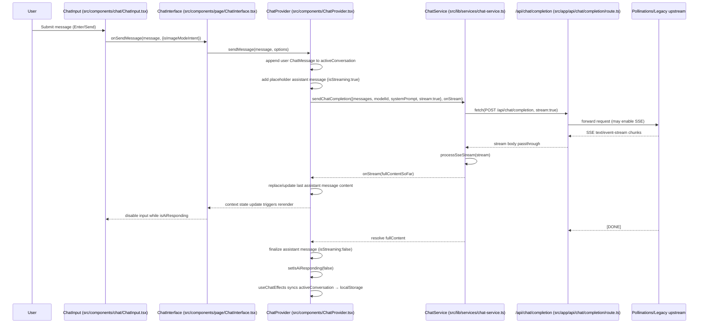

# Comprehensive Architecture Analysis

This document captures the current application architecture for the **HeyHi** Next.js (App Router) codebase, with emphasis on component hierarchy, provider composition, and end-to-end data flow.

> Primary implementation files live under `src/`.

---

## Component hierarchy, providers, and data flow (Chat)

### Provider tree (RootLayout → global providers → page providers)

**Root provider composition** is defined in:
- `src/app/layout.tsx` (exports `RootLayout`)

It wraps every page in:
- `src/components/ThemeProvider.tsx` (`ThemeProvider` → `next-themes`)
- `src/components/LanguageProvider.tsx` (`LanguageProvider` + `useLanguage()`)

The `/chat` route adds a **page-level** chat state container:
- `src/app/chat/page.tsx` (wraps `ChatPageContent` in `ChatProvider`)
- `src/components/ChatProvider.tsx` (`ChatProvider` + `useChat()`)

```text
RootLayout  (src/app/layout.tsx)
└─ ThemeProvider  (src/components/ThemeProvider.tsx)
   └─ LanguageProvider  (src/components/LanguageProvider.tsx)
      └─ /chat page segment  (src/app/chat/page.tsx)
         └─ ErrorBoundary  (src/components/ErrorBoundary.tsx)
            └─ ChatProvider  (src/components/ChatProvider.tsx)
               └─ ChatPageContent  (src/app/chat/page.tsx)
                  └─ AppLayout  (src/components/layout/AppLayout.tsx)
                     ├─ AppSidebar  (src/components/layout/AppSidebar.tsx)
                     └─ ChatInterface  (src/components/page/ChatInterface.tsx)
                        ├─ ChatView  (src/components/chat/ChatView.tsx)
                        │  └─ MessageBubble  (src/components/chat/MessageBubble.tsx)
                        └─ ChatInput  (src/components/chat/ChatInput.tsx)
                           └─ HistoryPanel  (src/components/chat/HistoryPanel.tsx)
```

Notes:
- `ThemeProvider` / `LanguageProvider` are **global**; they always exist for any route rendered by App Router.
- `ChatProvider` is **page-scoped** (currently only used on `/chat`), which keeps chat state isolated from other tools/pages.

---

### ChatProvider orchestration model (hooks + context)

`src/components/ChatProvider.tsx` is the **composition root** for the chat feature. It provides a single context (`ChatContext`) consumed via `useChat()`.

Internally, it composes the chat logic from four hooks, each with a dedicated responsibility:

1. **State container** — `useChatState`
   - File: `src/hooks/useChatState.ts`
   - Responsibilities:
     - Allocates all core chat `useState`/`useRef` primitives (conversation list, active conversation, UI flags, audio refs, recording refs).
     - Defines persistence-backed state via `useLocalStorageState`:
       - chat history list under `CHAT_HISTORY_STORAGE_KEY = "fluxflow-chatHistory"`
       - selected image model under `chatSelectedImageModel`

2. **Text-to-speech (TTS)** — `useChatAudio`
   - File: `src/hooks/useChatAudio.ts`
   - Responsibilities:
     - Fetches synthesized speech via `POST /api/tts`.
     - Controls `Audio` playback and related UI state (`playingMessageId`, `isTtsLoadingForId`).
   - Server implementation:
     - Route: `src/app/api/tts/route.ts`
     - Flow: `src/ai/flows/tts-flow.ts` (calls Replicate TTS model)

3. **Speech-to-text (STT) recording** — `useChatRecording`
   - File: `src/hooks/useChatRecording.ts`
   - Responsibilities:
     - Uses `navigator.mediaDevices.getUserMedia` + `MediaRecorder`.
     - Posts recorded audio (`FormData`) to `POST /api/stt`.
     - Appends transcribed text into the chat input (`setChatInputValue`).
   - Server implementation:
     - Route: `src/app/api/stt/route.ts`
     - Flow: `src/ai/flows/stt-flow.ts` (calls Deepgram)

4. **Side-effects & persistence synchronization** — `useChatEffects`
   - File: `src/hooks/useChatEffects.ts`
   - Responsibilities:
     - Initial chat selection on first load (or creates a new chat if none exists).
     - Syncs `activeConversation` → `allConversations` (persisted via `useLocalStorageState`).
     - Wires ESC key handlers for transient UI panels via `useEscapeKey` (`src/hooks/useEscapeKey.ts`).
     - Initializes `availableImageModels` from config (`FALLBACK_IMAGE_MODELS`) and validates `selectedImageModelId`.

The **service layer** used by `ChatProvider` is:
- `src/lib/services/chat-service.ts` (`ChatService`)

This consolidates client → API interactions (chat completion, title generation, and image generation) and is the primary boundary between UI state and Next.js route handlers.

---

### UI → state/action propagation (ChatInterface, ChatInput, ChatView, AppLayout, AppSidebar)

The `useChat()` context provided by `ChatProvider` is consumed in the UI at:
- `src/components/page/ChatInterface.tsx`

`ChatInterface` acts as the **adapter layer** between context actions/state and presentational components:

- **Input events** originate in `ChatInput` (`src/components/chat/ChatInput.tsx`)
  - Send message (enter/submit)
  - Toggle image mode / web browsing / code mode
  - Attach file / image; open camera dialog
  - Start/stop mic recording

- **Rendering & interaction** occur in `ChatView` (`src/components/chat/ChatView.tsx`) and `MessageBubble` (`src/components/chat/MessageBubble.tsx`)
  - Message list rendering
  - “Play audio” / “Copy” / “Regenerate” actions
  - Streaming cursor display when `message.isStreaming === true`

- **Shell layout** is provided by `AppLayout` (`src/components/layout/AppLayout.tsx`) and `AppSidebar` (`src/components/layout/AppSidebar.tsx`)
  - Sidebar navigation (Chat / Visualize / Settings)
  - Stores the sidebar expanded state under `sidebarExpanded`

---

## Data flows

### A) Chat completion flow (including streaming)

Relevant files:
- UI entry points: `src/components/chat/ChatInput.tsx`, `src/components/page/ChatInterface.tsx`
- Orchestrator: `src/components/ChatProvider.tsx` (`sendMessage`)
- Client service: `src/lib/services/chat-service.ts` (`ChatService.sendChatCompletion`)
- Streaming parser: `src/utils/chatHelpers.ts` (`processSseStream`)
- API route: `src/app/api/chat/completion/route.ts` (`POST`)

#### Sequence diagram (high level)



#### Key streaming mechanics

- The API route opts into streaming when the request includes `stream: true` and the model supports it.
  - `src/app/api/chat/completion/route.ts`: sets `Accept: text/event-stream` and returns a `Response(bodyStream)` with SSE headers.
- On the client, `ChatService.sendChatCompletion` detects streaming via `content-type` and parses the stream with `processSseStream`.
  - `src/lib/services/chat-service.ts` + `src/utils/chatHelpers.ts`
- `ChatProvider.sendMessage` updates the last assistant message repeatedly as chunks arrive.
  - `src/components/ChatProvider.tsx` (`onStream` callback updates `activeConversation.messages`)

---

### B) TTS flow (play assistant message)

Relevant files:
- UI trigger: `src/components/chat/MessageBubble.tsx` (`onPlayAudio(text, messageId)`)
- Client hook: `src/hooks/useChatAudio.ts`
- API route: `src/app/api/tts/route.ts`
- Server flow: `src/ai/flows/tts-flow.ts`

Bullet flow:
1. User clicks play on an assistant bubble (`MessageBubble`).
2. `ChatView` forwards to `ChatInterface`, which calls `handlePlayAudio` from `useChatAudio`.
3. `useChatAudio` posts `{ text, voice }` to `POST /api/tts`.
4. `src/app/api/tts/route.ts` calls `textToSpeech()`.
5. `src/ai/flows/tts-flow.ts` starts a Replicate prediction and polls until completion.
6. API returns `{ audioDataUri }`; the client creates a new `Audio(audioDataUri)` and plays it.

---

### C) STT flow (mic recording → transcription → input)

Relevant files:
- UI trigger: `src/components/chat/ChatInput.tsx` (Mic button)
- Client hook: `src/hooks/useChatRecording.ts`
- API route: `src/app/api/stt/route.ts`
- Server flow: `src/ai/flows/stt-flow.ts`

Bullet flow:
1. User presses mic in `ChatInput` → `startRecording()`.
2. `useChatRecording` captures audio via `MediaRecorder` and buffers `Blob`s.
3. On stop, it creates `recording.webm` and posts `FormData(audioFile)` to `POST /api/stt`.
4. `src/app/api/stt/route.ts` calls `speechToText(audioFile)`.
5. `src/ai/flows/stt-flow.ts` sends the bytes to Deepgram and returns `{ transcription }`.
6. The transcription is appended to the current input field via `setChatInputValue`.

---

### D) Image flows

#### D1) Image uploads inside chat (vision prompts)

Relevant files:
- UI selection: `src/components/chat/ChatInput.tsx` (file input)
- Orchestrator: `src/components/ChatProvider.tsx` (`handleFileSelect`, `sendMessage`)
- Upstream chat completion: `src/app/api/chat/completion/route.ts`

Bullet flow:
1. User attaches an image in `ChatInput`.
2. `ChatProvider.handleFileSelect` reads it via `FileReader` and stores:
   - `activeConversation.uploadedFile` (in-memory `File`)
   - `activeConversation.uploadedFilePreview` (Data URI)
3. On send, `ChatProvider.sendMessage` constructs OpenAI-style multi-part content:
   - `[{type:'text', ...}, {type:'image_url', image_url:{url:dataUri, isUploaded:true}}]`
4. The message is mapped to an API payload and sent to `POST /api/chat/completion`.
5. After completion (success or failure), the provider clears `uploadedFile`/`uploadedFilePreview` (ephemeral state).

#### D2) Image generation triggered from chat ("image mode")

Relevant files:
- Orchestrator: `src/components/ChatProvider.tsx` (`toggleImageMode`, `sendMessage`)
- Client service: `src/lib/services/chat-service.ts` (`ChatService.generateImage`)
- API routes:
  - Pollinations image/video: `src/app/api/generate/route.ts`
  - Replicate image/video: `src/app/api/replicate/route.ts`
- Model routing: `src/config/unified-image-models.ts` (via `getUnifiedModel()` used by `ChatService`)

Bullet flow:
1. User toggles image mode in `ChatInput`.
2. Sending a message in image mode calls `ChatService.generateImage()` instead of `sendChatCompletion()`.
3. `ChatService.generateImage()` selects the backend route:
   - `/api/generate` for Pollinations-backed models
   - `/api/replicate` for Replicate-backed models
4. The API returns an `imageUrl` (or video URL). `ChatProvider` inserts it as an assistant message with an `image_url` content part.

#### D3) Image tool uploads + gallery history (non-chat)

The unified image-generation UI maintains its own persistence boundary:
- UI: `src/components/tools/UnifiedImageTool.tsx`
- History storage key: `IMAGE_HISTORY_KEY = "imageHistory"` (localStorage)

Upload behavior depends on model/provider:
- Some Pollinations models require the reference image to be accessible via URL, so `UnifiedImageTool` uploads the file:
  - API route: `src/app/api/upload/route.ts` (Vercel Blob)
- Other models accept Data URIs directly, so the file is read locally via `FileReader`.

---

## Persistence boundaries (what is persisted, where)

This app relies on local-only persistence (browser storage) for most UX state.

### Chat-related

- Chat history list (`Conversation[]`)
  - Key: `fluxflow-chatHistory`
  - Allocated in: `src/hooks/useChatState.ts`
  - Synced in: `src/hooks/useChatEffects.ts`

- Selected image model for chat image mode
  - Key: `chatSelectedImageModel`
  - File: `src/hooks/useChatState.ts`

- User personalization values consumed by chat
  - Keys: `userDisplayName`, `customSystemPrompt`
  - File: `src/components/ChatProvider.tsx`

- Session-only UX flag for welcome screen
  - Key: `hasInteracted` (sessionStorage)
  - Set in: `src/components/ChatProvider.tsx`
  - Read in: `src/components/page/ChatInterface.tsx`

### Global UI

- Language
  - Key: `language`
  - File: `src/components/LanguageProvider.tsx`

- Sidebar expansion state
  - Key: `sidebarExpanded`
  - Files: `src/components/layout/AppLayout.tsx`, `src/components/layout/AppSidebar.tsx`

### Image tooling

- Image generation gallery/history
  - Key: `imageHistory`
  - File: `src/components/tools/UnifiedImageTool.tsx`

### Shared persistence mechanism

Most localStorage-backed state uses:
- `src/hooks/useLocalStorageState.ts`

This hook hydrates after mount to avoid SSR mismatches and emits `CustomEvent("local-storage-${key}")` to synchronize state across components in the same tab.
