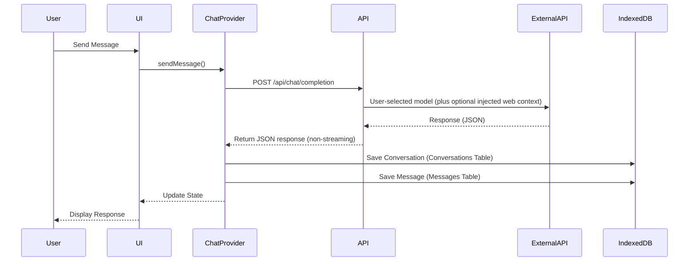

# HeyHi Technical Architecture Diagram

## System Overview

```mermaid
graph TB
    subgraph "Client Side"
        UI[React UI Components]
        State[ChatProvider Context]
        Local[IndexedDB (Dexie.js)]
        Hooks[Custom Hooks]
    end
    
    subgraph "Next.js Backend"
        API[API Routes]
        WebContext[WebContextService (RAG)]
        Auth[Authentication Middleware]
    end
    
    subgraph "External Services"
        Pollinations[Pollinations API]
        Replicate[Replicate API]
        S3[AWS S3 (Asset Vault)]
        WebSearch[Search via Pollinations (Sonar / Gemini Search)]
    end
    
    UI --> State
    State --> Local
    State --> Hooks
    UI --> API
    API --> WebContext
    WebContext --> WebSearch
    API --> Pollinations
    API --> Replicate
    Hooks --> Local
```

## Component Architecture

```mermaid
graph TD
    subgraph "Layout Components"
        AppLayout[AppLayout]
        Sidebar[AppSidebar]
        Theme[ThemeProvider]
        Lang[LanguageProvider]
    end
    
    subgraph "Page Routes"
        Home[/unified]
        Settings[/settings]
        About[/about]
        Gallery[/gallery]
    end
    
    subgraph "Feature Components"
        Landing[LandingView]
        Chat[ChatInterface]
        Personalization[PersonalizationTool]
        GalleryGrid[GalleryGrid]
    end
    
    subgraph "Integrated Tools"
        ImageTool[UnifiedImageTool Logic]
    end
    
    Home --> Landing
    Home --> Chat
    Landing -.-> ImageTool
    Chat -.-> ImageTool
    Settings --> Personalization
    Gallery --> GalleryGrid
```

## Data Flow Architecture



## State Management Flow

```mermaid
graph LR
    subgraph "State Sources"
        UserInput[User Input]
        APIResponses[API Responses]
        DexieDB[IndexedDB (Dexie)]
        LocalStorage[LocalStorage]
    end
    
    subgraph "State Management"
        ChatProvider[ChatProvider]
        Hooks[useChatPersistence, useChatUI]
    end
    
    UserInput --> ChatProvider
    APIResponses --> ChatProvider
    DexieDB -- "Conversations & Assets" --> ChatProvider
    LocalStorage -- "UI Prefs" --> Hooks
    
    ChatProvider --> Hooks
    Hooks --> UI
```

## Storage Architecture (Hybrid)

```mermaid
graph LR
    subgraph "Browser Storage (Dexie.js)"
        Conversations[Conversations Table]
        Messages[Messages Table]
        Assets[Assets Table (Blobs)]
        Memories[Memories Table]
    end
    
    subgraph "Remote Storage"
        S3[AWS S3]
    end
    
    Conversations -- "Metadata" --> ChatProvider
    Messages -- "Content" --> ChatProvider
    Assets -- "Binary Data" --> ChatProvider
    
    S3 -- "Signed URLs" --> API
    API -- "Proxy" --> ChatProvider
```

## Dexie Database Schema (v3)

The application uses a typed Dexie.js database instance (`HeyHiDatabase`) with the following schema:

| Table | Primary Key | Indexes | Description |
| :--- | :--- | :--- | :--- |
| **`conversations`** | `id` (UUID) | `updatedAt`, `modelId` | Stores chat session metadata, title, and settings. |
| **`messages`** | `id` (UUID) | `conversationId`, `timestamp` | Stores individual messages, including content and references. |
| **`assets`** | `id` (UUID) | `conversationId`, `timestamp` | Stores binary data (Blobs) for images/audio to avoid LocalStorage limits. |
| **`memories`** | `id` (UUID) | `type`, `importance` | Stores AI-generated memories and user facts (Future use). |
