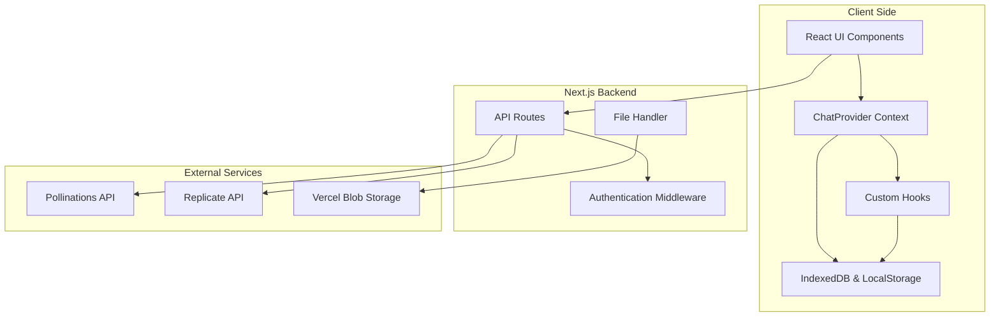
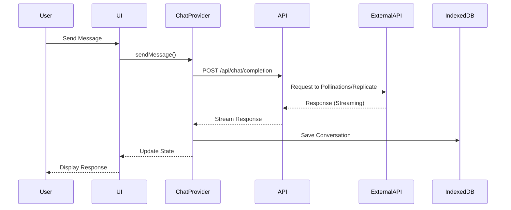
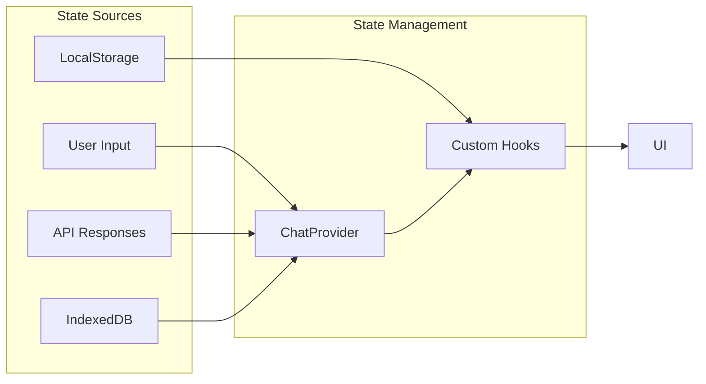

# HeyHi Technical Architecture Diagram

## System Overview



## Component Architecture

```mermaid
graph TD
    subgraph "Layout Components"
        AppLayout[AppLayout]
        Sidebar[AppSidebar]
        Theme[ThemeProvider]
        Lang[LanguageProvider]
    end
    
    subgraph "Page Routes"
        Home[/unified]
        Settings[/settings]
        About[/about]
    end
    
    subgraph "Feature Components"
        Landing[LandingView]
        Chat[ChatInterface]
        ImageTool[UnifiedImageTool]
        Personalization[PersonalizationTool]
    end
    
    Home --> Landing
    Home --> Chat
    Landing --> ImageTool
    Chat --> ImageTool
    Settings --> Personalization
```

## Data Flow Architecture



## State Management Flow



## Storage Architecture

```mermaid
graph LR
    subgraph "Browser Storage"
        IDB[(IndexedDB)]
        LS[(LocalStorage)]
    end
    
    IDB -- "Full Chat Objects" --> ChatProvider
    LS -- "UI Prefs & System Prompts" --> Hooks
    
    subgraph "Asset Storage"
        VercelBlob[Vercel Blob]
    end
    
    API -- "Upload Media" --> VercelBlob
    VercelBlob -- "Public URL" --> IDB