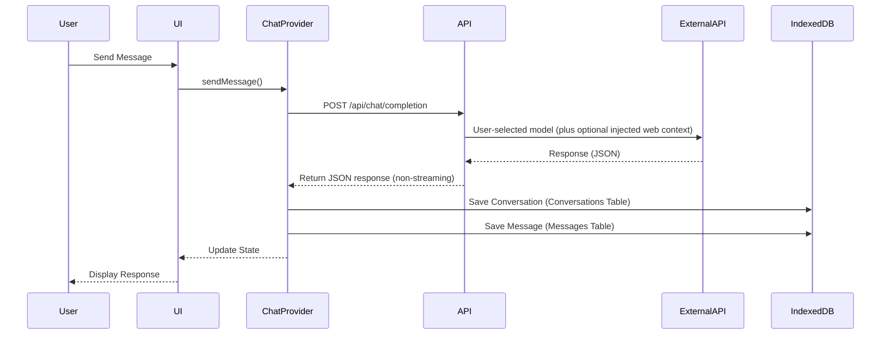

# HeyHi Technical Architecture Diagram

## System Overview

```mermaid
graph TB
    subgraph "Client Side"
        UI[React UI Components]
        State[ChatProvider Context]
        Local[IndexedDB (Dexie.js)]
        Hooks[Custom Hooks]
    end
    
    subgraph "Next.js Backend"
        API[API Routes]
        WebContext[WebContextService]
        Uploads[Media Upload + Ingest]
    end
    
    subgraph "External Services"
        Pollinations[Pollinations API]
        Media[Pollinations Media Storage]
        WebSearch[Search via Pollinations]
    end
    
    UI --> State
    State --> Local
    State --> Hooks
    UI --> API
    API --> WebContext
    WebContext --> WebSearch
    API --> Pollinations
    API --> Uploads
    Uploads --> Media
    Hooks --> Local
```

## Component Architecture

```mermaid
graph TD
    subgraph "Layout Components"
        AppLayout[AppLayout]
        Sidebar[AppSidebar]
        Theme[ThemeProvider]
        Lang[LanguageProvider]
    end
    
    subgraph "Page Routes"
        Home[/unified]
        Settings[/settings]
        About[/about]
        Output[/gallery]
    end
    
    subgraph "Feature Components"
        Landing[LandingView]
        Chat[ChatInterface]
        Personalization[PersonalizationTool]
        OutputGrid[GalleryGrid]
    end
    
    subgraph "Integrated Tools"
        ImageTool[UnifiedImageTool Logic]
    end
    
    Home --> Landing
    Home --> Chat
    Landing -.-> ImageTool
    Chat -.-> ImageTool
    Settings --> Personalization
    Output --> OutputGrid
```

## Data Flow Architecture

```mermaid
sequenceDiagram
    participant User
    participant UI
    participant ChatProvider
    participant API
    participant ExternalAPI
    participant IndexedDB
    
    User->>UI: Send Message
    UI->>ChatProvider: sendMessage()
    ChatProvider->>API: POST /api/chat/completion
    API->>ExternalAPI: User-selected model (plus optional injected web context)
    ExternalAPI-->>API: Response (JSON)
    API-->>ChatProvider: Return JSON response (non-streaming)
    ChatProvider->>IndexedDB: Save Conversation (Conversations Table)
    ChatProvider->>IndexedDB: Save Message (Messages Table)
    ChatProvider-->>UI: Update State
    UI-->>User: Display Response
```

## State Management Flow

```mermaid
graph LR
    subgraph "State Sources"
        UserInput[User Input]
        APIResponses[API Responses]
        DexieDB[IndexedDB (Dexie)]
        LocalStorage[LocalStorage]
    end
    
    subgraph "State Management"
        ChatProvider[ChatProvider]
        Hooks[useChatPersistence, useChatUI]
    end
    
    UserInput --> ChatProvider
    APIResponses --> ChatProvider
    DexieDB -- "Conversations & Assets" --> ChatProvider
    LocalStorage -- "UI Prefs" --> Hooks
    
    ChatProvider --> Hooks
    Hooks --> UI
```

## Storage Architecture (Hybrid)

```mermaid
graph LR
    subgraph "Browser Storage (Dexie.js)"
        Conversations[Conversations Table]
        Messages[Messages Table]
        Assets[Assets Table (Metadata + optional Blob fallback)]
        Memories[Memories Table]
    end
    
    subgraph "Remote Storage"
        Media[Pollinations Media Storage]
    end
    
    Conversations -- "Metadata" --> ChatProvider
    Messages -- "Content" --> ChatProvider
    Assets -- "Metadata + optional fallback blob" --> ChatProvider

    Media -- "Immutable media URLs" --> API
    API -- "Resolve via storageKey / remoteUrl" --> ChatProvider
```

## Dexie Database Schema (v3)

The application uses a typed Dexie.js database instance (`HeyHiDatabase`) with the following schema:

| Table | Primary Key | Indexes | Description |
| :--- | :--- | :--- | :--- |
| **`conversations`** | `id` (UUID) | `updatedAt`, `modelId` | Stores chat session metadata, title, and settings. |
| **`messages`** | `id` (UUID) | `conversationId`, `timestamp` | Stores individual messages, including content and references. |
| **`assets`** | `id` (UUID) | `conversationId`, `timestamp` | Stores asset metadata plus optional blob fallback for images/audio/video. |
| **`memories`** | `id` (UUID) | `type`, `importance` | Stores AI-generated memories and user facts (Future use). |
